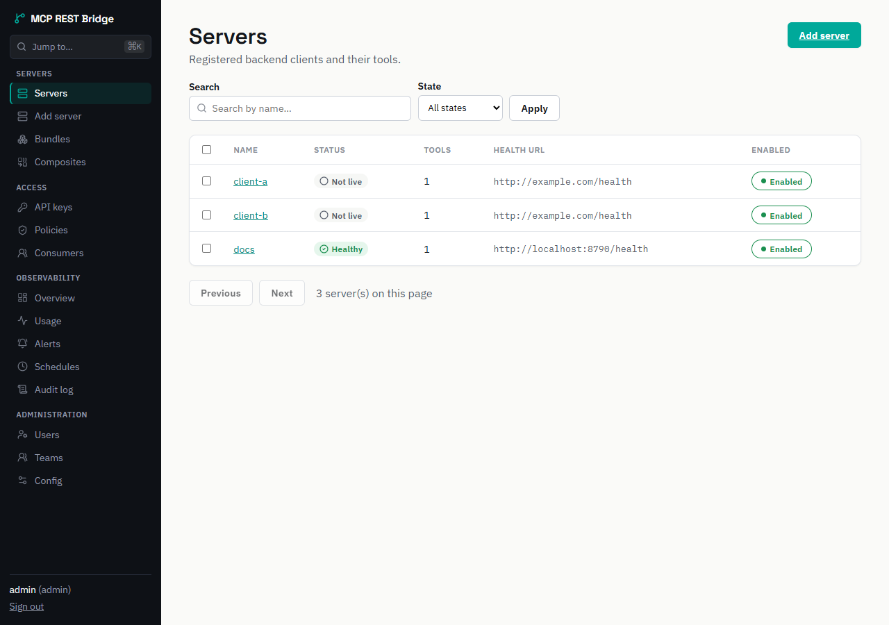
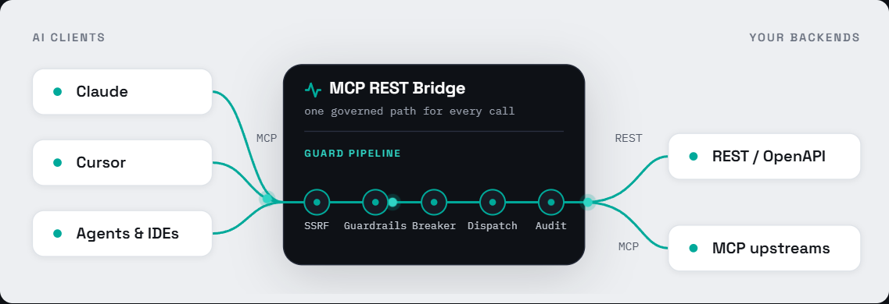

<!--
  Versión en español. El repo canónico en inglés sigue siendo README.md.
  Esta duplicación se mantiene sincronizada a mano; si haces un cambio
  significativo en cualquiera de los dos, replica el cambio aquí.
-->
<div align="center">


# MCP REST Bridge

### Convierte cualquier servidor REST, GraphQL o MCP en herramientas de IA seguras y gobernadas.

**El gateway MCP auto-hospedado con una UI de administración real** — auto-descubrimiento
OpenAPI-a-MCP, guardrails por herramienta, RBAC, circuit breaking. Un único binario. Sin
Kubernetes.

[](https://github.com/CarlxsMG/mcpbridge/actions/workflows/ci.yml)
[](https://bun.sh)
[](https://www.typescriptlang.org/)
[](https://modelcontextprotocol.io)
[](LICENSE)
[](#-contribuir)
[](https://stryker-mutator.io)
[](https://github.com/CarlxsMG/mcpbridge)

[**🎮 Demo en vivo**](https://carlxsmg.github.io/mcpbridge/demo/) ·
[**Web y docs**](https://carlxsmg.github.io/mcpbridge/) ·
[Primeros pasos](#-quickstart-de-60-segundos) ·
[Funcionalidades](#-funcionalidades) ·
[¿Por qué esto frente a las alternativas?](#-mcp-rest-bridge-vs-las-alternativas)

</div>

---

**MCP REST Bridge** es un **gateway/proxy/agregador MCP** open-source para el
[Model Context Protocol](https://modelcontextprotocol.io) (negocia la versión del protocolo
MCP a través del **SDK oficial**, que soporta desde `2024-10-07` hasta `2025-11-25` y
usa `2025-03-26` por defecto cuando el cliente no indica versión). Apúntalo a un spec OpenAPI/Swagger, un endpoint GraphQL, un comando `curl`
o una colección Postman y convierte tu API en herramientas MCP automáticamente. Registra un
servidor MCP existente y lo re-expone a través del mismo
pipeline gobernado. Cada llamada pasa por protección SSRF, sanitización de prompt-injection,
rate limits por herramienta, circuit breakers, RBAC y un log de auditoría a prueba de
manipulaciones — y todo lo gestionas desde una **UI de administración integrada**, no desde
un montón de YAML. Probado contra **Claude Desktop**, **Cursor** y agentes MCP personalizados.

<div align="center">



**▶ [Prueba la demo en vivo](https://carlxsmg.github.io/mcpbridge/demo/)** — la UI
de administración completa funcionando con datos mock, sin instalar nada.

</div>

## 🔌 Convierte cualquier cosa a MCP

Seis formas de convertir un backend en tools MCP gobernadas — una llamada `POST /register`, y
luego cada llamada pasa por la misma guard pipeline:

| Tu backend                   | Regístralo con            | Se convierte en                      |
| ---------------------------- | ------------------------- | ------------------------------------ |
| API REST (OpenAPI / Swagger) | `openapi_url`             | una tool MCP por operación           |
| API GraphQL                  | `graphql_url`             | una tool por query y mutation        |
| Un comando `curl`            | `curl_input`              | una tool desde la request            |
| Colección Postman (v2.1)     | `postman_collection`      | una tool por request                 |
| Sin spec — a mano            | `tools[]`                 | exactamente las tools que definas    |
| Servidor MCP existente       | `kind: "mcp"` + `mcp_url` | sus tools, re-expuestas y gobernadas |

Consulta **[Registrar backends →](https://carlxsmg.github.io/mcpbridge/es/guide/registering-backends)**
para el payload de cada uno, y **[Bundles →](https://carlxsmg.github.io/mcpbridge/es/guide/bundles)**
para servir varios backends por un solo endpoint.

## ✨ Por qué MCP REST Bridge

- **Una UI de admin real, no ficheros de config.** Un dashboard Vue 3 completo para
  registrar servidores, curar bundles de herramientas, definir guardrails, rotar keys,
  supervisar el uso y leer el log de auditoría.
- **Bidireccional en un binario.** REST, GraphQL y OpenAPI → MCP **y** MCP → gateway MCP.
  Agrega muchos backends detrás de un endpoint curado (un bundle).
- **Testeado de verdad, no solo verde.** Una suite de 330+ ficheros en el backend, Vitest
  para el admin UI, e2e con Playwright, y **mutation testing con [Stryker](https://stryker-mutator.io)**
  que inyecta fallos para probar que los tests atrapan bugs de verdad.
- **Seguro por defecto.** Protección SSRF + DNS-rebinding con anclaje de IP, sanitización
  de prompt-injection, detección de secretos y restricciones fail-closed de keys por
  herramienta — integrado, no como plugin.
- **Funcionalidades enterprise sin peso enterprise.** RBAC, equipos, audit hash-chain +
  SIEM, canary/failover, tracing OpenTelemetry, versionado de config — **sin Kubernetes y
  sin base de datos externa.**
- **Ejecuta en cualquier sitio.** Proceso único Bun + `bun:sqlite`. Una imagen Docker, o
  `bun src/index.ts`.

## 🚀 Quickstart de 60 segundos

### Docker

```bash
docker build -t mcpbridge .

export ADMIN_API_KEY=$(openssl rand -hex 24)

docker run -p 3000:3000 \
  -e NODE_ENV=development \
  -e SESSION_COOKIE_SECURE=false \
  -e BOOTSTRAP_ADMIN_USERNAME=admin \
  -e BOOTSTRAP_ADMIN_PASSWORD=change-me-min-12-chars \
  -e ADMIN_API_KEYS=$ADMIN_API_KEY \
  -v "$PWD/data:/app/data" \
  mcpbridge
```

Abre la UI de admin en **http://localhost:3000/admin** e inicia sesión con las credenciales
bootstrap. `$ADMIN_API_KEY` es el token Bearer que usan los ejemplos `curl`/CLI de abajo —
mantenlo exportado en el mismo shell. (`NODE_ENV=development` + `SESSION_COOKIE_SECURE=false`
son solo para HTTP local — en producción ejecuta sobre HTTPS y elimina ambas.)

> **¿Prefieres no compilar desde el código?** Cuando se publique la primera release, cada
> release publicará una imagen prebuilt, multi-arch y firmada en GHCR — entonces podrás quitar
> el paso `docker build` y usar `ghcr.io/carlxsmg/mcpbridge:latest` como imagen en
> `docker run`. Hasta entonces, compila en local con el `docker build` de arriba. Consulta
> [Despliegue](https://carlxsmg.github.io/mcpbridge/es/guide/deployment).

### Bun (desarrollo local, con hot reload)

```bash
bun install
cp .env.example .env                 # luego configura BOOTSTRAP_ADMIN_PASSWORD (mín 12 chars)
cd admin-ui && bun install && cd ..

bun run dev:all                      # backend :8790 + admin UI :8791
# → abre http://localhost:8791/admin/
```

> **Nota:** el modo dev usa a propósito puertos distintos (8790/8791) que el 3000 por
> defecto de Docker/producción — puertos altos y poco comunes para que un servidor dev local
> no choque con 3000 (o con una instancia real de gateway) que también puedas tener
> ejecutándose. Consulta [Configuración](https://carlxsmg.github.io/mcpbridge/es/guide/configuration)
> para la referencia completa de puertos.

> **Todos los ejemplos de `curl`, config de cliente y `cli --url` de abajo usan
> `http://localhost:3000`** (el puerto de Docker). En la ruta Bun el backend está en `:8790` en
> su lugar — define `export BASE=http://localhost:8790` y sustituye `$BASE` por
> `http://localhost:3000`, o simplemente reemplaza el puerto a mano.

### Registra tu primera API REST (auto-descubierta desde OpenAPI)

Desde la UI: **Añadir servidor → REST**, pega una URL de OpenAPI, listo. O vía API:

```bash
curl -X POST http://localhost:3000/register \
  -H "Authorization: Bearer $ADMIN_API_KEY" \
  -H "Content-Type: application/json" \
  -d '{
    "name": "petstore",
    "health_url": "https://petstore3.swagger.io/",
    "openapi_url": "https://petstore3.swagger.io/api/v3/openapi.json"
  }'
```

### Registra un servidor MCP existente como upstream

```bash
curl -X POST http://localhost:3000/register \
  -H "Authorization: Bearer $ADMIN_API_KEY" \
  -H "Content-Type: application/json" \
  -d '{
    "name": "github",
    "kind": "mcp",
    "mcp_url": "https://your-mcp-server.example.com/mcp",
    "mcp_transport": "streamable-http"
  }'
```

### Apunta un cliente MCP al bridge

Apúntalo a un shard de backend — el `petstore` que registraste está en `/mcp/petstore`:

```json
{
  "mcpServers": {
    "petstore": { "url": "http://localhost:3000/mcp/petstore" }
  }
}
```

Sirve tools de backend de dos maneras: por cliente `/mcp/:name` (un backend) o un bundle
curado `/mcp-custom/:bundle` (varios tras un endpoint). La raíz `/mcp` es el control plane
(tools `sys_*` de gestión del gateway), no tools de backend — todo sobre Streamable HTTP.

### CLI (config-as-code)

¿Prefieres gestionar la configuración como un fichero YAML revisable en lugar de hacer clic
en la UI? Un CLI `gateway` viene en el repo — sin instalación separada, solo
`bun run cli -- <command>`:

```bash
bun run cli -- login --url http://localhost:3000 --token $ADMIN_API_KEY
bun run cli -- pull    # escribe la config en vivo a gateway.yaml
bun run cli -- plan    # muestra drift vs. gateway.yaml, exit no-cero si hay (CI-friendly)
bun run cli -- apply   # registra servidores + aplica config desde gateway.yaml
bun run cli -- connect --client claude-desktop --scope system   # imprime la config del cliente MCP para pegar
```

Flags globales, independientes de cualquier subcomando: `help` / `-h` / `--help` (también el
comportamiento por defecto sin ningún comando) y `version` / `-v` / `--version`, ambos
saliendo con `0`.

Consulta **[CLI docs →](https://carlxsmg.github.io/mcpbridge/es/guide/cli)** para la
referencia completa de comandos y el formato de `gateway.yaml`.

## 🧩 Funcionalidades

**Conecta cualquier cosa**

- Auto-descubrimiento **OpenAPI / Swagger → MCP** — apunta a un spec, obtén tools al instante
- **GraphQL → MCP** — introspecciona el schema, una tool por query y mutation
- **Import cURL / Postman** — deriva tools de un `curl` pegado o una exportación Postman v2.1
- **Definiciones manuales de tools** cuando no hay spec
- Gateway / agregador **MCP → MCP** (upstreams Streamable HTTP + SSE)
- Dos modos de servir de datos: por cliente `/mcp/:name` y bundles curados `/mcp-custom/:bundle` (la raíz `/mcp` es el control plane del sistema)

**Gobernar y asegurar**

- Protección SSRF + DNS-rebinding, **anclaje de IP** por upstream
- **Guardrails**: sanitización de prompt-injection, detección de secretos, reglas de denegación de inputs
- **Rate limits, timeouts, restricciones de keys permitidas** por herramienta + **circuit breakers** por cliente
- **RBAC** (admin / operator / auditor / viewer) + **multi-tenancy por equipos**
- **Log de auditoría a prueba de manipulaciones** (encadenado por hash) + streaming a SIEM

**Opera con confianza**

- **UI de admin** (Vue 3): dashboard, servidores, bundles, keys, uso, alertas, programaciones, auditoría
- **CLI** (`bun run cli`) para config-as-code: `login` / `pull` / `plan` / `apply` contra `gateway.yaml`, más `connect` para generar configs de cliente MCP — consulta [CLI docs](https://carlxsmg.github.io/mcpbridge/es/guide/cli)
- Monitorización de salud + auto-eliminación; **canary / failover** secundarios
- **Versionado de config + rollback**, import / export
- Prometheus `/metrics` + tracing **OpenTelemetry (OTLP)** por llamada de tool
- Alertas de **anomalía / pico de uso** vía webhooks
- Tools compuestas / macro, una meta-tool `search_tools` y un playground de requests

**Ejecuta en cualquier sitio**

- Proceso único Bun, almacenamiento `bun:sqlite` — **sin DB externa, sin Kubernetes**
- Una imagen Docker, o `bun src/index.ts`

## 🔀 Cómo funciona

<p align="center">
  
</p>

El bridge anuncia una lista unificada de tools a cualquier cliente MCP, luego redirige cada
llamada al backend correcto a través de la pila completa de guards (chequeo SSRF →
guardrails → política por herramienta → circuit breaker → dispatch → sanitización de
response → audit).

## ⚖️ MCP REST Bridge vs. las alternativas

|                                                 | CLIs OpenAPI→MCP | Gateways pesados (k8s) | **MCP REST Bridge** |
| ----------------------------------------------- | :--------------: | :--------------------: | :-----------------: |
| REST / GraphQL / OpenAPI → MCP                  |        ✅        |        parcial         |         ✅          |
| Gateway MCP → MCP                               |        ❌        |           ✅           |         ✅          |
| UI de admin                                     |        ❌        |        algunos         |     ✅ Vue SPA      |
| Seguridad integrada (SSRF, inyección, secretos) |        ❌        |        algunos         |         ✅          |
| RBAC + audit + equipos                          |        ❌        |           ✅           |         ✅          |
| Ejecuta sin Kubernetes                          |        ✅        |           ❌           |         ✅          |
| Sin base de datos externa                       |        ✅        |           ❌           |  ✅ (Bun + SQLite)  |

_Las capacidades varían según el proyecto; esto es posicionamiento general, no un scorecard
de ninguna herramienta específica._

## 📚 Documentación

Las docs completas viven en la **[web del proyecto](https://carlxsmg.github.io/mcpbridge/)**:
[Primeros pasos](https://carlxsmg.github.io/mcpbridge/es/guide/getting-started) ·
[Funcionalidades](https://carlxsmg.github.io/mcpbridge/es/guide/features) ·
[¿Por qué MCP REST Bridge?](https://carlxsmg.github.io/mcpbridge/es/guide/why-mcp-rest-bridge)

¿Prefieres aprender con ejemplos? El directorio **[`examples/`](examples/)** trae muestras listas
para copiar y ejecutar: un body de `POST /register` por cada modo de registro, un `gateway.yaml`
config-as-code, y configs drop-in de clientes MCP.

## 🛠️ Stack técnico

[Bun](https://bun.sh) · TypeScript (strict) · Express 5 ·
[`@modelcontextprotocol/sdk`](https://github.com/modelcontextprotocol) ·
`bun:sqlite` · Vue 3 + Vite (admin UI). Sin ORM, dependencias mínimas.

## 🤝 Contribuir

¡Contribuciones bienvenidas! El bridge está cubierto por **varios sistemas de test, no uno** —
**Bun** para la suite de 330+ ficheros del backend, **Vitest** para el admin UI, **Playwright**
end-to-end, y encima **mutation testing con [Stryker](https://stryker-mutator.io)** (que inyecta
fallos para probar que los tests atrapan bugs de verdad, no solo ejecutan líneas). Después de
cualquier cambio:

```bash
tsc --noEmit                            # type-check del backend
bun run test                            # tests del backend (deberían estar 100% verdes)
bun run test:e2e                        # end-to-end con Playwright (e2e/)
bun run test:mutate                     # mutation testing con Stryker (acota a los ficheros cambiados)
cd admin-ui && bun run typecheck        # type-check del admin UI
cd admin-ui && bun run test             # tests del admin UI (Vitest)
cd admin-ui && bun run build            # build de producción del admin UI
```

Abre un issue para discutir cambios grandes primero. Las buenas primeras contribuciones
están etiquetadas en el tracker. Consulta la **[guía de contribución en español](docs/es/guide/contributing.md)**
para los detalles completos (el [`CONTRIBUTING.md`](CONTRIBUTING.md) raíz es la versión canónica, en inglés).

## 📄 Licencia

MIT — consulta [`LICENSE`](LICENSE).

---

<div align="center">

**Palabras clave:** MCP gateway · MCP proxy · MCP aggregator · Model Context Protocol ·
OpenAPI to MCP · REST to MCP · self-hosted MCP · MCP admin UI · MCP RBAC · AI tool gateway

Si este proyecto te ayuda, por favor ⭐ **[destácalo en GitHub](https://github.com/CarlxsMG/mcpbridge)**
— es la mayor señal que ayuda a otros a descubrirlo.

</div>
